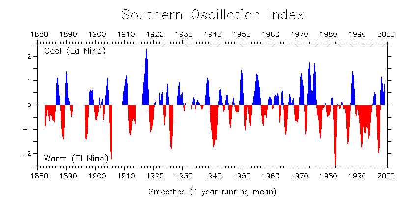

# Time Series (TS)

#### Used in
- control of inventory, based on demand trends
- airline's decision to buy airplanes bc of passenger trends and decision to increase/maintain market share
- climate change decisions based on temperature change trends
- business/sales forecasting
- everyday operational decisions
- long-term effects of proposed water management policies by simulating daily rainfall and sea state time series
- understanding fluctuations in monthly sales
- basis for signal processing in telecommunications <?>
- disease incidence tracking, yearly rates
- census analysis
- tracking monthly unemployment rate; as an economic indicator used by decision makers

#### Used to
- to understand the past, and predict the future
- forcasting (predicting inference, a subset of statistical inference). assumes that present trends continue. This assumption cannot be checked empirically, but, when we identify the likely causes for a trend, we can justify the forecasting(extrapolating it) for a few time-steps at least
- anomaly detection
- clustering
- classification (assigning a time series pattern to a specific category: e.g. gesture recognition of hand movements in sign language videos)
- query by content ~ Content-based image retrieval

#### Data: 
a variable measured sequentially in time, or at a fixed [sampling] interval 

#### serial dependence problem:
observations close together in time tend to be correlated (serially dependent)

TS tries to explain this correlation (serial dependence)
autocorrelation analysis examines this serial dependence <?>

### conditions (assumptions of TS)
- Stationary process:
  * if there's no systematic change in mean (no trend) AND
  * if there's no systematic change in variance, AND
  * if strictly periodic variations have been removed
    * i.e. the properties of one section of the data are much like those of any other section
    * often we have a non-stationary TS => we need to remove trend and seasonality, to get a stationary residual, which then can be modeled using a stationary stochastic process 
- Ergodic process: a stationary TS that we assume is sufficiently long time series that it characterises the hypothetical model. (~ independent of the starting point)

```{r}
plot(AirPassengers)
start(AirPassengers)
end(AirPassengers)
frequency(AirPassengers)
plot(AirPassengers)
summary(AirPassengers)
layout(1:2)
# takes an input matrix for the location of each plot in the graphics window
plot(aggregate(AirPassengers))
boxplot(AirPassengers ~ cycle(AirPassengers))
```

plotting shows _patterns_, and _features_ of the data + *outliers* and *erroneous* values 


### patterns
1. trend = a non-periodic systematic change in a TS: a long-term change in the 'mean'
    * can be modeled simply by a linear increase or decrease. (only if it's deterministic ~ it's non-stochastic)
    * stochastic trend: seems to change direction at unpredictable times rather than displaying a consistent pattern (e.g. like the air passenger series)
2. seasonal variation = a repeating pattern within a fixed period (e.g. each year)
3. cycles = a non-fixed-period cycle (without a fixed period). example: El-Nino



##### Monthly unemployment rate for a state
```{r}
# monthly unemployment rate for the US state of Maine from January 1996 until August 2006
Maine.month <- read.table("http://staff.elena.aut.ac.nz/Paul-Cowpertwait/ts/Maine.dat", header = TRUE)
# header TRUE means treat first row as column names
attach(Maine.month)
str(Maine.month)
head(Maine.month)
class(Maine.month)
# it's a data.frame, not a ts object. So, we need to convert it to ts
Maine.month.ts <- ts(unemploy, start = c(1996, 1), freq = 12)
Maine.month.ts
Maine.annual.ts <- aggregate(Maine.month.ts)/12
layout(1:2)
plot(Maine.month.ts)
plot(Maine.annual.ts)
Maine.Feb <- window(Maine.month.ts, start = c(1996,2), freq = TRUE)
Maine.Aug <- window(Maine.month.ts, start = c(1996,8), freq = TRUE)
Feb.ratio <- mean(Maine.Feb) / mean(Maine.month.ts)
Aug.ratio <- mean(Maine.Aug) / mean(Maine.month.ts)
```
---
#### Natoionwide unemployment rate
```{r}
# monthly unemployment rate for all of the United States from January 1996 until October 2006
US.month <- read.table("http://staff.elena.aut.ac.nz/Paul-Cowpertwait/ts/USunemp.dat", header = T)
attach(US.month)
US.month.ts <- ts(USun, start=c(1996,1), end=c(2006,10), freq = 12)
plot(US.month.ts, ylab = "unemployed (%)")
```
---
### Multiple TS 
```{r}
ChocolateBeerElectricity <- read.table("http://staff.elena.aut.ac.nz/Paul-Cowpertwait/ts/cbe.dat", header = TRUE)
class(ChocolateBeerElectricity)
str(ChocolateBeerElectricity)
Chocolate.ts <- ts(ChocolateBeerElectricity[,1], start = 1958, frequency = 12)
Beer.ts <- ts(ChocolateBeerElectricity[,2], start = 1958, frequency = 12)
Electricity.ts <- ts(ChocolateBeerElectricity[,3], start = 1958, frequency = 12)

plot(cbind(Chocolate.ts, Beer.ts, Electricity.ts))

# intersection of multiple TS
compareTwoTSChocolateBeer <- ts.intersect(Chocolate.ts, Beer.ts)
# bind time series which have a common frequency
?ts.intersect()
head(compareTwoTSChocolateBeer)

layout(1:2)
plot(compareTwoTSChocolateBeer[,1])
plot(compareTwoTSChocolateBeer[,2])
cor(Chocolate.ts, Beer.ts)
# correlation
```

#### Climate change
```{r}
# Global temperature anomalies from the monthly means over the period
GlobalTemperatures <- scan("http://staff.elena.aut.ac.nz/Paul-Cowpertwait/ts/global.dat")
# scan to read data into a vector or list from the console or file.
?scan
str(GlobalTemperatures)
GlobalTemperatures.ts <- ts(GlobalTemperatures, st = c(1856,1), end = c(2005,1), frequency = 12)
head(GlobalTemperatures.ts)
tail(GlobalTemperatures.ts)
Global.annual <- aggregate(GlobalTemperatures.ts, FUN = mean)
head(Global.annual)
Global.annual
plot(GlobalTemperatures.ts)
plot(Global.annual)  

#
GlobalTemperatures1970to2005 <- window(GlobalTemperatures.ts, start=c(1970, 1), end=c(2005, 12))
# subset a time window
?window
GlobalTemperatures1970to2005.time <- time(GlobalTemperatures1970to2005)
# create the vector of times at which a time series was sampled
?time
plot(GlobalTemperatures1970to2005)
abline(reg = lm(GlobalTemperatures1970to2005 ~ GlobalTemperatures1970to2005.time))
```

--- 

In statistics, usually, first thing, we compute the 'mean' and 'variance/standard deviation', which show 'location' and 'dispersion':

- mean ~ location
- variance ~ dispersion

or

- mean ~ central location
- variance ~ the spread

### Transformations

Transform the data (e.g. log or square-root) when:

1. if variance appears to increase with the mean.
    * if standard deviation is directly proportional to the mean (a trend), LOG transform!
    * if variance changes through time, but without a trend, transformation won't help. use a model that accommodates variance change
2. if there's additive seasonal effect, i.e. size of seasonal effect increases with the mean, transform! to make seasonal effect constant. 
    * If there's multiplicative seasonal effect, i.e. size of seasonal effect proportional to the mean, LOG transform! to make the seasonal effect additive. (variance gets stable, but error term will still remain unstable)
3. if there are spikes in the data, (skewness), transform to normalize the data distribution.

> avoid transformations, except where the transformed has a direct physical interpretation

### Sample autocorrelation coefficients

- a series of quantities, that measure the correlation between observations at different distances apart
- show us which probability model to use for that data


- negative correlation? shows high values of x tend to go with low values of y
- zero correlation? shows two variables are independent

#### serial correlation coefficients (e.g. at lag 1), 
or autocorrelation coefficients

- measures correlation between successive observations
- serial correlation coefficients at lag k
- if you graph it, it's called 'correlogram'
- ac.f and correlogram is meaningful ONLY IF data is STATIONARY
- ac.f and correlogram is meaningless for non-stationary

### how to interpret a Correlogram

- if r_0 = 1, r_1 = large value, r_2, r_3 = diminishingly successively smaller values, r_k = almost zero
    then, TS: one observation 'above' the mean tends to be followed by more observations 'above' the mean, and
              one observation 'below' the mean tends to be followed by more observations 'below' the mean

- if r_0 = 1, r_1 = negative value, r_2 = positive value, r_3 = negative, ... (diminishingly successively smaller values)
    then, TS: one observation 'above' the mean tends to be followed by more observations 'below' the mean,
            aka alternating: successive observations on both sides of the overall mean

- if r_0...k are all positive and large values, TS is non-stationary, and correlogram is meaningless

- if r_0...k oscillate, TS is 'seasonal', e.g. sinusoidal. check at least 3 seasons worth of r_k

### Covariance

$$ Cov(x,y) = E(xy) - E(x)E(y)$$
$$Var(x+y) = Var(x) + Var(y) + 2 Cov(x,y)$$

## Basic stochastic models

- residual error series =     observed data - fitted values (from the model)
- if our model is good (i.e. captures the deterministic features of the TS)
  * then residual TS should be a realization of independent random variables from a probability distribution

### White Noise (WN) [stochastic model for modeling residual TS]

- a TS is discrete WN, if the observations (variables) $w_1, ..., w_t$ are I.I.D. with mean = zero, and all variables have same variance $\sigma^2$ and their pairwise Covariance is zero. 
  * if, additionally, they are normally distributed, then it's Gaussian WN.
  


- mean = 0
- $Cov(w_i, w_j) = 0 for all i \neq j$
  
#### Simulation: to make a synthetic TS (vs. observed TS)


Why simulate?

- generate plausible future scenarios
- bootstrapping: constructing confidence intervals for the model parameters


```{r}
# provide a starting point for the random generation function, to make sure the random generation can be reproduced next time you're running the code, to get the same data
set.seed(1)

# rnorm simulates 100 random variables that are standard normal and independent
# which can be used as a Gaussian WN TS of length 100
w <- rnorm(100)

plot(w, type = "l")

# ?dnorm
# w2 <- dnorm(w, mean = 0, sd = 1, log = FALSE)
# plot(w2, type = "l")


x <- seq(-3,3, length = 1000)
hist(rnorm(100), prob = T)
points(x, dnorm(x), type = "l")

# correlogram of WN TS
set.seed(200)
acf(rnorm(200))
# the correlations (for lag > 1) is (almost because of sampling variation) zero for almost all (95%)
```

### Random Walk (RW) TS [stochastic model for modeling residual TS]

is a good model to fit to data with stochastic trends (not as good as ARIMA though)

TS ${x_t}$ is a RW, if $$x_t = x_{t-1} + w_t$$, where $w_t$ is a WN TS. So, we can back substitute $x_{t-1}$ with $x_{t-2} + w_{t-1}$ and so on, and get: $$x_t = w_1 + w_2 + w_3 + ... + w_t$$ (i.e. a finite sum of WN, each with mean = zero and var = $\sigma^2$ )

- mean = 0
- $Cov(x_t,x_{t+k}) = t\sigma^2$ => TS is non-stationary because the Covariance depends on time t. variance increases as t increases => RW model is good ONLY for short-term predictions

#### backshift(lag) operator (B)

$B x_t = x_{t-1}$
$B^n x_t = x_{t-n}$

#### difference operator (to make a stationary TS from a non-stationary TS)

$$\Delta x_t = x_t - x_{t-1}$$

$$\Delta x_t = (1 - B) x_t$$

$$\Delta^n = (1 - B)^n$$

```{r}
# generate WN TS as w
x <- w <- rnorm(1000)
# make a RW TS using backshift and WN TS
for (t in 2:1000) x[t] <- x[t - 1] + w[t]
# plot the RW TS with lines
plot(x, type = "l")
# draw the RW TS correlogram
acf(x)
```

#### diagnosis of a RW TS:

its correlogram should look like this:
```{r}
?diff
# this correlogram shows a RW TS (as a diagnostic tool)
acf(diff(x))
```

### Random Walk with drift TS [stochastic model for modeling residual TS]

e.g. for stocks, stockholders expect the value of their investment to increase despite the volatility of financial markets. (this increase can be mapped by a drift (upwards) parameter (delta))

$$x_t = x_{t-1} + \delta + w_t$$

```{r}
# HP stock prices
HP.dat <- read.table("http://staff.elena.aut.ac.nz/Paul-Cowpertwait/ts/HP.txt", header = T)
attach(HP.dat)
# plot the stock price TS
plot (as.ts(HP.dat$Price))
# calculate drift parameter \delta
drift <- diff(Price)
plot (as.ts(drift))
# check correlogram of drift to make sure it's a WN TS 
acf(drift)
# calculate confidence interval
mean(drift) + c(-2, 2) * sd(drift)/sqrt(length(drift))
```

### AutoRegressive TS of order p AR(p)[stochastic model for modeling residual TS]

when the model is a regression of $x_t$ on its past terms from the same TS.

$$x_t = \alpha_1 x_{t-1} + \alpha_2 x_{t-2} + ... + \alpha_p x_{t-p} + w_t$$ 

where

- $w_t$ is WN TS
- $\alpha_i$ are model parameters
- $\alpha_p \neq 0$ for an AR(p) TS

i.e. value of TS at time t depends not only on t-1 but t-2 and ... t-p (i.e. p steps back)

$$\theta(B)x_t = (1 - \alpha_1 B^1 - \alpha_2 B^2 - ... - \alpha_p B^p)x_t = w_t$$

#### how to tell if an AR(p) TS is stationary or non-stationary?

$\theta(B) = 1 - \alpha_1 B^1 - \alpha_2 B^2 - ... - \alpha_p B^p$ is called characteristic equation (CE). 

- If all roots of CE for an AR(p) are > 1, (their absolute value is > 1), AR(p) is stationary. 
- If even one of the roots of CE is <= 1 in absolute value, then AR(p) is non-stationary.

```{r}
# find roots of a polynomial
polyroot(c(1, 2, 1))

rho <- function(k, alpha) alpha^k
layout(1:2)
plot(0:10, rho(0:10, 0.7), type = "b")
plot(0:10, rho(0:10, -0.7), type = "b")

set.seed(1)
x <- w <- rnorm(100)
for (t in 2:100) x[t] <- 0.7 * x[t - 1] + w[t]
plot(x, type = "l")
acf(x)
pacf(x)
```

#### AR(p) TS model fitting in R

```{r}
# fit an AutoRegression AR(p) model
x.ar <- ar(x, method = "mle")

x.ar$order

# parameter estimate (alpha bar)
x.ar$ar
x.ar$asy.var
x.ar$ar + c(-2, 2) * sqrt(x.ar$asy.var)

# str(x.ar)
```

---
# Stationary Models

#### Strictly stationary TS

A time series model ${x_t}$ is strictly stationary if the joint statistical distribution of $x_{t1}, ..., x_{tn}$ is the same as the joint distribution of $x_{t1+m}, ..., x_{t_{n+m}}$ for
all $t_1, ..., t_n$ and m, so that the distribution is unchanged after an arbitrary
time shift.

- mean and variance are constant in time
- $Cov(x_t, x_s)$ only depends on the lag $k = |t - s|$

## Moving Average MA(q) TS model

MA(q) is a linear combination of current WN and the most recent past WN terms:

$$ x_t = w_t + \beta_1 w_{t-1} + ... + \beta_q w_{t - q} $$

where ${w_t}$ is a WN TS with 

- mean = zero
- variance = $\sigma^2_w$

$$x_t = (1 + \beta_1B + \beta_2B^2 + ... + \beta_qB^q)w_t = \phi_q(B)w_t$$

- $\phi_q$ is a polynomial of order q. 
- MA is stationary because it consists of a finite sum of stationary WN terms
- MA has time-invariant mean and time-invariant autocovariance

#### invertible MA(q) process

- if an MA(q) TS can be expressed as a stationary AR(infiniti) process of infinite order without an error term, it's invertible. 
- if the roots of $\phi_q(B)$ > 1 is absolute value, MA(q) is invertible. 

e.g. $$x_t = (1 - \beta B)w_t$$ is invertible:
$$w_t = (1-\beta B)^{-1}x_t$$ if $|\beta| < 1$ (condition for convergence)

```{r}
# to fit an MA(q) model to TS data, use
## arima(TSdata, order = c(0, 0, q))
x.ma <- arima(x, order = c(0, 0, 3))
x.ma
```

Example:

```{r}
x <- read.table("http://staff.elena.aut.ac.nz/Paul-Cowpertwait/ts/pounds_nz.dat", header = T)
x.ts <- ts(x, st = 1991, fr = 4)

# fit an MA(1) model to the data
x.ma <- arima(x.ts, order = c(0, 0, 1))
# check the variance
x.ma
# variance is 0.04172. more than the variance that we got from fitting a AR(1) model to the same data (with variance = 0.03125):
ar(x.ts)
# so AR(1) is a better model than MA(1) for this data.

acf(x.ma$res[-1])
```

---
### ARMA(p,q) models: AR(p) + MA(q) combined together: AutoRegressive Moving Average

- AR(p):
$$x_t = \alpha_1 x_{t-1} + \alpha_2 x_{t-2} + ... + \alpha_p x_{t-p} + w_t$$ 
- MA(q):
$$ x_t = w_t + \beta_1 w_{t-1} + ... + \beta_q w_{t - q} $$
- ARMA(p,q):
$$x_t = \alpha_1 x_{t-1} + \alpha_2 x_{t-2} + ... + \alpha_p x_{t-p} + w_t + \beta_1 w_{t-1} + ... + \beta_q w_{t - q} $$


$$\theta_p(B) x_t = \phi_q(B) w_t$$

- ARMA(p,q) TS is STATIONARY if roots of $\theta$ > 1 in absolute value
- ARMA(p,q) TS is INVERTIBLE if roots of $\phi$ > 1 in absolute value
- ARMA(p, 0) = AR(p)
- ARMA(0,q) = MA(q)
- ARMA(p,q) is better (parameter efficient) than either a single AR(p) or MA(q)


